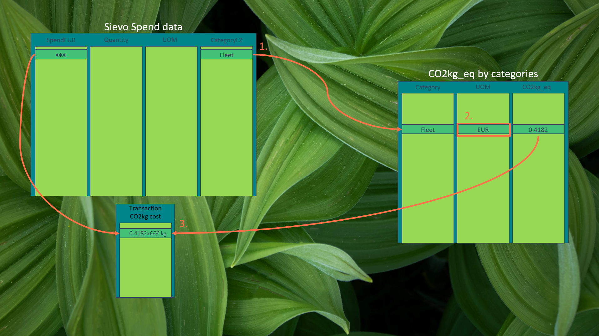
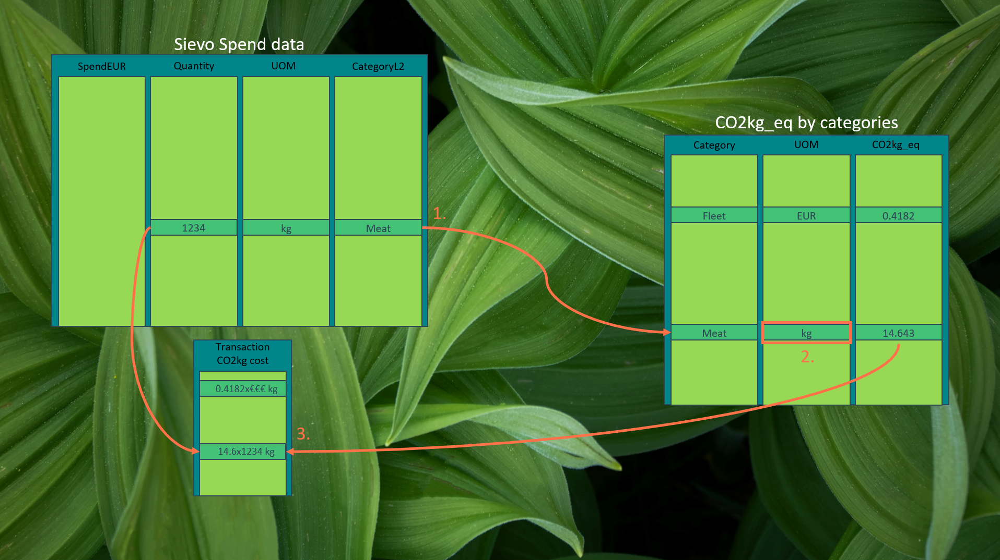

[(click here to go to the first page)](./)

[(click here to go to the dashboard)](./another-page.html)

## Brief overview of how the data was extracted and calculated

When We looked at the “spend data” file, we noticed that:
1.    There were very few unique categories in the CategoryL2 column
2.    Matching these categories with the categories in the emission tables provided would not be as simple as just matching words.

Therefore, we decided that it would not be time-effective to implement some natural language process to match these together. Instead, we decided to manually compile our own emission table based on the category names found in the CategoryL2 column.

This emission table consisted simply of three columns: category, UOM, and CO2keg equivalent. The UOM was based on in which form the spend data procurements were accounted for, as to make it possible to approximate the CO2 resulting form that transaction.

Then combining the “spend data” with its categories emission data and the matching quantity resulted in the transactions CO2kg value.

The approximations are quite rough due to the wide categories. Generally the approximations done based on weight (kg) are better than the ones based on value (spentEUR), as the value based approximation cant take into account possible discounts affecting the price. Also, in the case of negative spending numbers in the date we have taken the assumption that the products have been returned, and the CO2 have been subtracted from the total. Even though it well could have indicated a deal and just a cashback.

## Future development

The exactness of the approximations could be made much better by making a more detailed emissions table. Which could be connected not only to the procurement category, but instead to the actual product. This would make the resulting CO2kg_eq very exact and make it possible for companies to compare different products not only on the cost but also on its environmental impact. This date could also be used by the companies to automate their reporting of their environmental impact to different certification agencies in case they are applying for such.

[(click here to go to the first page)](./)

[(click here to go to the dashboard)](./another-page.html)